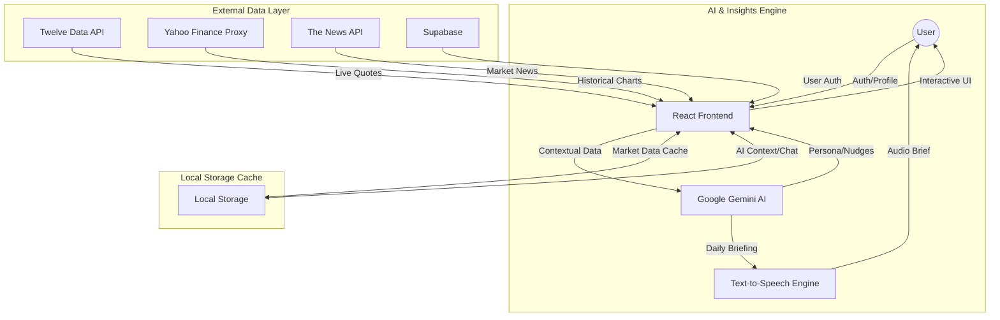

# ET Concierge - AI-Driven Financial Companion

ET Concierge is a professional, AI-powered financial assistant designed for the Indian market. It combines real-time market data, personalized AI insights, and a sleek, modern interface to help investors navigate their wealth management journey.

## 🚀 Key Features

### 1. Personalized Onboarding
- **AI Persona Generation**: A conversational onboarding process that identifies your investor profile (e.g., Maverick Investor, Prudent Saver).
- **Goal Mapping**: Tailors the entire dashboard based on specific goals like "Buy a Home," "Save Taxes," or "Grow Wealth."

### 2. Live Market Intelligence
- **NIFTY 50 Analysis**: Real-time tracking of the NIFTY 50 index with dynamic 8-day interactive charts.
- **Smart Snapshots**: Live price tracking for major stocks (RELIANCE, TCS, etc.), Forex (USD/INR), and Crypto (BTC).
- **Automated Gain Calculations**: Precise tracking of price changes using a real-time relative baseline formula.

### 3. AI Insights & Guidance
- **Daily Financial Nudge**: A unique, AI-generated actionable tip provided every morning based on the current market and your profile.
- **Personalized Daily Briefing**: An interactive, text-to-speech enabled briefing that summarizes the market and provides a custom recommendation.
- **AI News Context**: Automatically analyzes news headlines to provide a "Why this matters to you" note for every article.
- **24/7 AI Chat Guide**: A persistent AI companion that understands your entire financial profile for deep, contextual Q&A.

### 4. Financial Health Monitoring
- **Health Score Rings**: Visual tracking of your status across Savings, Investments, Risk, and Goals.
- **Sentiment Analysis**: Real-time market sentiment visualization.

### 5. Specialized Service Advisors
- **Dedicated AI Experts**: Specialized chat agents for specific services like Home Loans, Term Insurance, and SIPs.
- **Recommendation Engine**: Automatically highlights financial services and ET events that match your profile.

## 🛠️ Technical Stack
- **Frontend**: React (TypeScript) + Vite
- **Styling**: Vanilla CSS (Modern aesthetic with Glassmorphism)
- **Charts**: Recharts
- **Authentication**: Supabase
- **AI Models**: Google Gemini (Flash 2.0 / 1.5)
- **APIs**:
  - Twelve Data (Stock/Market Quotes & Time Series)
  - The News API (Financial News)
  - Yahoo Finance (Historical Market Data)

## 🔒 Security & Performance
- **Data Privacy**: Local storage encryption for chat histories and profiles.
- **Smart Caching**: Implemented localStorage caching for API responses (Market data, News, AI Nudges) to prevent excessive API calls and handle 429 errors.
- **CORS Handling**: Robust fallback system to switch between primary and secondary data providers.

## 🏗️ System Architecture

The following diagram illustrates the data flow and integration between the frontend, AI engine, and external market APIs.

---
© 2026 The Economic Times. All rights reserved.
