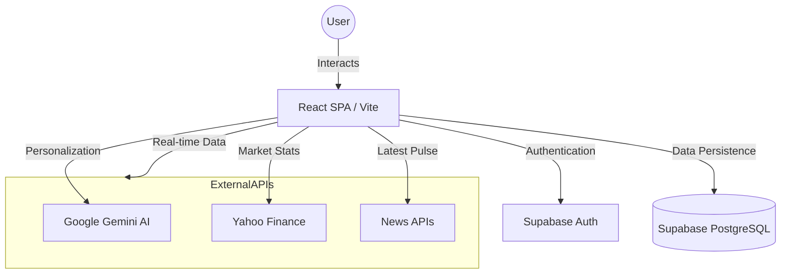
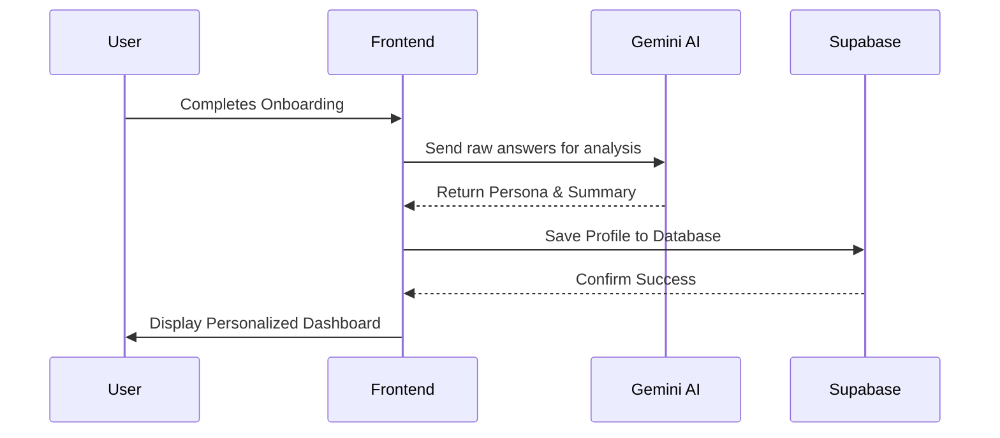

#  ET Concierge - Your Professional AI Financial Companion

ET Concierge is a production-grade, AI-driven financial dashboard designed to empower investors with personalized market intelligence, real-time analytics, and expert wealth management tools. Built on the foundation of The Economic Times ecosystem, it transforms complex market data into actionable personal insights.

---

## 📈 About the Project

ET Concierge is more than just a dashboard; it's a personalized experience that learns your financial DNA. By analyzing your risk appetite, goals, and sector interests, the platform filters the noise of the global markets to deliver only what's relevant to you. Whether you're a conservative saver or an aggressive growth investor, ET Concierge provides the clarity needed to make informed decisions.

### 🌟 Why ET Concierge?
Traditional financial apps overwhelm users with generic data. ET Concierge solves this by:
*   **Contextualizing News:** AI-generated "Why this matters" notes for every headline.
*   **Predictive Guidance:** Daily "Nudges" based on your current portfolio goals.
*   **Holistic Health:** Real-time financial health rings tracking Savings, Investments, and Risk.

---

## 🚀 Key Features

### 🧠 AI & Personalization
*   **Conversational Onboarding:** A smart AI flow that builds your financial persona (e.g., "Prudent Saver" or "Maverick Investor").
*   **Morning Financial Briefing:** Personalized daily audio briefings generated by AI (Text-to-Speech).
*   **24/7 AI Concierge:** A persistent chat assistant for deep-dives into market strategies and product advice.
*   **Smart News Feed:** Sector-specific news with AI-powered relevance analysis.

### 📊 Market Intelligence
*   **Multi-Asset Tracking:** Real-time data for Stocks (NIFTY 50, Blue-chips), Forex (USD/INR), and Crypto (BTC).
*   **Interactive Analytics:** High-fidelity technical charts powered by **Recharts** with 1D to 1M range views.
*   **Live Sparklines:** Instant visual performance snapshots for quick market sentiment analysis.

### 💼 Wealth & Admin
*   **Service Advisor:** Personalized modals for expert guidance on tax-saving, global investing, and more.
*   **Event Management:** Discovery and registration for exclusive ET masterclasses and networking events.
*   **Comprehensive Admin Suite:** A dedicated portal for managing services, tracking engagement stats, and seeding professional content.

---

## 🛠️ Tech Stack

### Frontend
*   **Framework:** [React 18](https://reactjs.org/) with [TypeScript](https://www.typescriptlang.org/)
*   **Build Tool:** [Vite](https://vitejs.dev/)
*   **Styling:** [Tailwind CSS](https://tailwindcss.com/) & [Shadcn UI](https://ui.shadcn.com/)
*   **Charts:** [Recharts](https://recharts.org/)
*   **Icons:** [Lucide React](https://lucide.dev/)
*   **State Management:** [TanStack Query (React Query)](https://tanstack.com/query/latest)

### Backend & APIs
*   **Backend-as-a-Service:** [Supabase](https://supabase.com/) (PostgreSQL, Auth, Real-time)
*   **AI Engine:** [Google Gemini API](https://ai.google.dev/) (2.0 Flash)
*   **Market Data:** Yahoo Finance API
*   **News APIs:** Marketaux, TheNewsAPI

### Testing & Tools
*   **Unit/Component Testing:** [Vitest](https://vitest.dev/)
*   **E2E Testing:** [Playwright](https://playwright.dev/)
*   **Linting:** [ESLint](https://eslint.org/)

---

## 🏗️ Architecture Overview



### Data Flow: AI Personalization



---

## 📂 Folder Structure

```text
C:\Users\rohit\Desktop\ets\
├── supabase/               # SQL Migrations & Config
├── src/
│   ├── components/
│   │   ├── ui/             # Reusable Shadcn components
│   │   └── NavLink.tsx     # Navigation elements
│   ├── contexts/           # AuthContext (Supabase)
│   ├── hooks/              # Custom React hooks
│   ├── integrations/
│   │   └── supabase/       # Client config & generated types
│   ├── lib/                # Utility functions
│   ├── pages/              # Main Route Components
│   │   ├── Admin.tsx       # Admin Dashboard
│   │   ├── Index.tsx       # Core App / Dashboard
│   │   ├── Landing.tsx     # Marketing Page
│   │   └── Auth.tsx        # Login/Register
│   ├── App.tsx             # Routing Logic
│   └── main.tsx            # Entry point
├── public/                 # Static Assets
└── package.json            # Dependencies & Scripts
```

---

## ⚙️ Installation & Setup

1.  **Clone the repository:**
    ```bash
    git clone <repository-url>
    cd et-concierge
    ```

2.  **Install dependencies:**
    ```bash
    npm install
    # OR
    bun install
    ```

3.  **Set up Environment Variables:**
    Create a `.env` file in the root directory:
    ```env
    VITE_SUPABASE_URL=your_supabase_url
    VITE_SUPABASE_ANON_KEY=your_supabase_anon_key
    VITE_GEMINI_KEY=your_google_gemini_api_key
    VITE_NEWS_KEY=your_thenewsapi_key
    VITE_Marketaux_API_KEY=your_marketaux_api_key
    ```

4.  **Database Setup:**
    Run the SQL migrations found in `supabase/migrations/` or the `CREATE_ADMIN.sql` script in your Supabase SQL Editor to initialize the tables for profiles, services, and events.

5.  **Start the development server:**
    ```bash
    npm run dev
    ```

---

## 📖 Usage Guide

*   **Onboarding:** Start by answering the AI Concierge's questions to build your profile.
*   **Dashboard:** View your personalized "Daily Action" and click on "Daily Brief" to hear your audio update.
*   **Market Analysis:** Click on any stock in the snapshot to update the main technical graph.
*   **AI Chat:** Use the chat window at the bottom to ask specific questions like "How can I save tax this year?"
*   **Admin Access:** Navigate to `/admin/login` to manage the platform's featured services and track user engagement.

---

## 🔮 Future Improvements

- [ ] **Portfolio Integration:** Allow users to link their actual demat accounts for real-time portfolio tracking.
- [ ] **Advanced Backtesting:** AI-powered strategy backtester for retail traders.
- [ ] **Community Hub:** Moderated forums for investors to share sector-specific insights.
- [ ] **Mobile App:** Native iOS/Android versions using React Native.

---

## 📜 License

© 2026 The Economic Times. Developed for professional financial advisory. All rights reserved.
