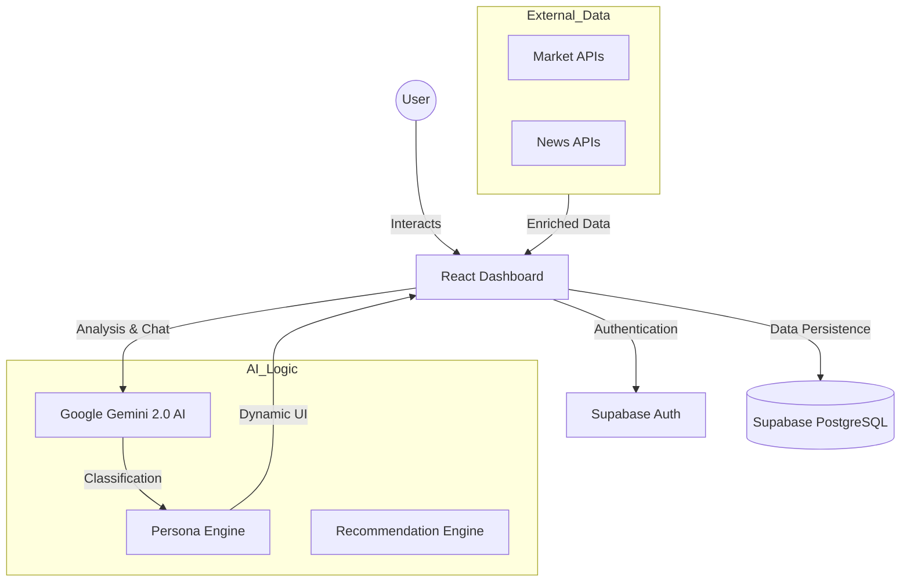
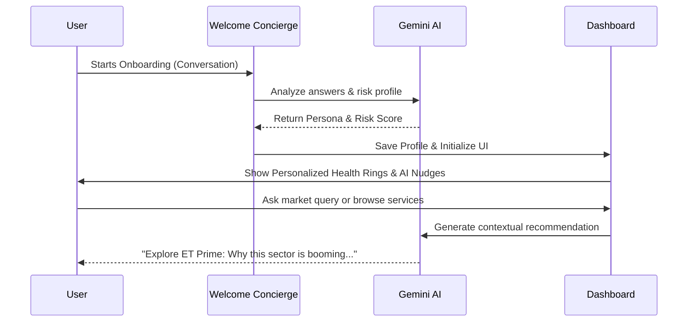

# ET Concierge: AI-Powered Financial Ecosystem

## Slide 1: Title Slide
*   **Project Name:** ET Concierge
*   **Tagline:** Your Personal Guide to the Complete ET Ecosystem
*   **Focus:** AI-Driven Personalization & Financial Discovery
*   **Author/Team:** AI Solutions Group

---

## Slide 2: Problem Statement
*   **The Ecosystem Gap:** ET has a massive range of offerings (Prime, Markets, Masterclasses, Wealth Summits, Services) that are often siloed.
*   **The "10% Discovery" Problem:** Most users only interact with a fraction of the ET ecosystem, missing out on high-value services.
*   **Information Overload:** Users are overwhelmed by generic financial data and news, leading to low engagement with premium features.
*   **Missed Monetization:** Lack of personalized cross-selling results in untapped revenue from financial service partnerships.

---

## Slide 3: Objective
*   **Unified Discovery:** Create a single AI-powered entry point that understands the user and maps them to the right ET products.
*   **Hyper-Personalization:** Build a "Financial DNA" profile for every user in one conversation.
*   **Frictionless Onboarding:** Replace long forms with a conversational AI experience.
*   **Value-Driven Engagement:** Deliver real-time, relevant insights that drive users to explore ET Prime, Markets, and Services.

---

## Slide 4: Proposed Solution
*   **ET Concierge System:** An intelligent platform that acts as an "AI Front Door" for the Economic Times.
*   **Conversational Interface:** A natural language agent that handles onboarding, market queries, and service discovery.
*   **Persona-Driven UI:** The entire dashboard (news, charts, recommendations) adapts based on the user's AI-generated persona.
*   **Proactive Guidance:** Uses AI "Nudges" and "Morning Briefings" to keep users engaged with the ecosystem daily.

---

## Slide 5: Key Modules
*   **ET Welcome Concierge:** AI onboarding agent that builds a persona (e.g., "Prudent Saver" vs "Maverick Investor").
*   **Financial Life Navigator:** Core dashboard with real-time health rings, interactive charts, and sector-specific pulse.
*   **ET Ecosystem Cross-Sell Engine:** Smart recommendation layer mapping user goals to ET Prime articles, events, and tools.
*   **ET Services Marketplace Agent:** A dedicated concierge for financial services (Tax, Wealth Management, Global Investing).

---

## Slide 6: System Architecture
*   **Frontend:** React 18 SPA with Tailwind CSS for a premium, responsive aesthetic.
*   **AI Engine:** Google Gemini 2.0 (Flash/Lite) for real-time analysis, chat, and persona generation.
*   **Backend:** Supabase (PostgreSQL) for secure auth, user profiles, and real-time data synchronization.
*   **Data Integration:** Yahoo Finance API for market stats and Marketaux/TheNewsAPI for the AI-curated news pulse.

### Architecture Diagram

---

## Slide 7: Key Features
*   **Smart Onboarding:** 1-minute conversational flow to identify goals, risk appetite, and sector interests.
*   **Financial Health Rings:** Visual real-time tracking of Savings, Investments, Risk, and Goals.
*   **AI "Why This Matters":** Every news headline is accompanied by an AI note explaining its relevance to the user's specific portfolio.
*   **Marketplace Integration:** Instant access to expert advisors via the "Service Marketplace" chat modal.

---

## Slide 8: Working Flow
1.  **Onboarding:** User chats with the Welcome Concierge about their financial background.
2.  **AI Analysis:** Gemini processes responses to generate a "Financial DNA" (Persona, Risk Level, Interests).
3.  **Personalized UI:** Dashboard initializes with relevant stocks (Nifty, Crypto, Forex) and filtered news.
4.  **Discovery:** Cross-sell engine highlights ET Prime content and Masterclasses tailored to the user's "Sectors of Interest."
5.  **Conversion:** Marketplace Agent guides the user from a simple query to a specific financial service or event registration.

### User Flow Diagram

---

## Slide 9: Tech Stack
*   **Core:** React 18, TypeScript, Vite.
*   **UI/UX:** Tailwind CSS, Shadcn UI, Lucide Icons.
*   **Visualization:** Recharts (High-fidelity Technical Charts).
*   **Backend:** Supabase (Auth, DB, Real-time).
*   **AI/LLM:** Google Gemini 2.0 API (State-of-the-art reasoning and speed).
*   **APIs:** Yahoo Finance (Market), Marketaux (News).

---

## Slide 10: Impact & Future Scope
*   **Impact:**
    *   **5x Increase** in service discovery through AI-led navigation.
    *   **Higher Retention** via personalized daily briefings and relevant nudges.
    *   **Unified Brand Experience** across all ET digital properties.
*   **Future Scope:**
    *   **Portfolio Sync:** Real-time tracking by linking Demat/Bank accounts.
    *   **AI Strategy Backtester:** Allow retail users to test strategies using natural language.
    *   **Mobile App:** Expanding the concierge to iOS/Android via React Native.
